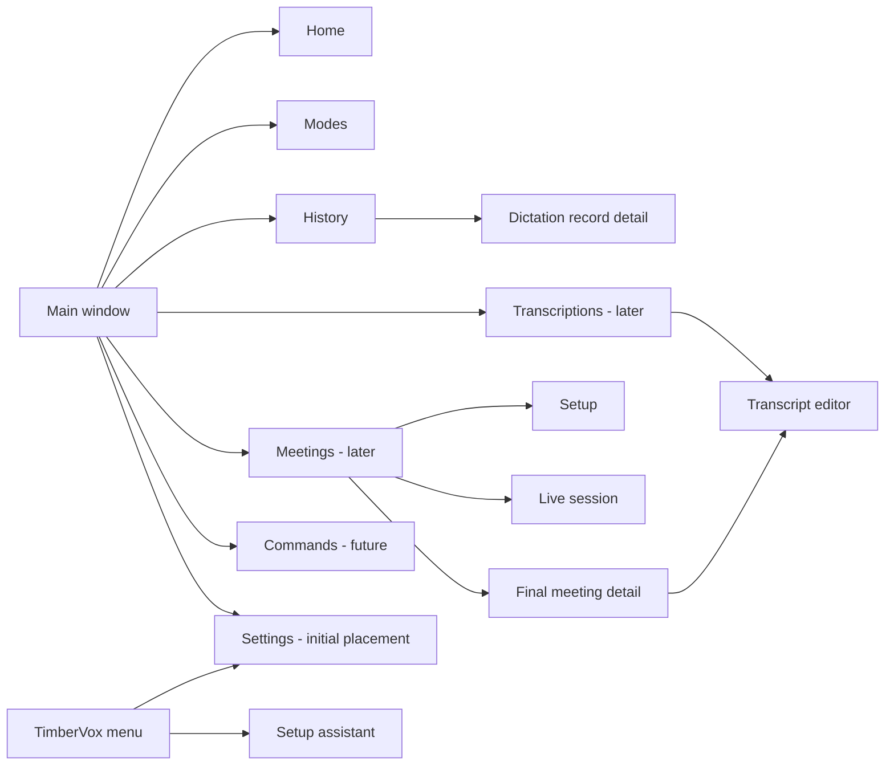

# TimberVox UI architecture

Status: active design discussion. This document defines proposed product surfaces and
interaction principles. It does not claim that the described UI or runtime paths are
implemented. `TODO.md` remains the canonical active checklist, `REBUILD.md` remains the
product roadmap, and `transcription-contract-architecture.md` remains authoritative for
the distinctions between dictation, file transcription, and meetings.

## Purpose

TimberVox needs one coherent macOS information architecture before individual panes are
polished. The current app proves several runtime paths, but its visible shell still mixes
first-run setup, recovery actions, primary workflows, object libraries, and durable
preferences.

This document is the design track for answering:

- Which destinations belong in the main window?
- What is Home for after onboarding is complete?
- Which collections justify list-detail navigation?
- Where do permissions, shortcuts, modes, imported transcripts, and meetings belong?
- Which stock SwiftUI or AppKit controls should be tried before custom composition?
- Which layouts should be prototyped before the production UI is changed?

## Apple design baseline

Use Apple's Human Interface Guidelines as guidance rather than as a checklist that
automatically produces the right product.

- A sidebar represents broad peer areas and a shallow information hierarchy. It should
  not become a list of every setting or every object.
- A content list between a sidebar and a detail view is justified when the selected area
  contains a substantial collection of objects.
- Toolbars contain the current view title, navigation, search, and frequent actions.
  Infrequent object-management actions can live in a More menu.
- Onboarding should be fast and optional, defer nonessential configuration, explain why
  a permission benefits the person, and teach the core workflow through a real action.
- Settings contain durable preferences. On macOS, they normally live in a separate,
  stable Settings window opened from the app menu with Command-Comma.
- Prefer stock controls and system materials. Custom composition is reserved for product
  interactions that stock controls cannot express, such as the passive recording
  indicator, transcript timeline, or live meeting visualization.

References:

- https://developer.apple.com/design/human-interface-guidelines/designing-for-macos/
- https://developer.apple.com/design/human-interface-guidelines/sidebars
- https://developer.apple.com/design/human-interface-guidelines/toolbars
- https://developer.apple.com/design/human-interface-guidelines/onboarding
- https://developer.apple.com/design/human-interface-guidelines/settings
- https://developer.apple.com/design/human-interface-guidelines/lists-and-tables
- https://developer.apple.com/design/human-interface-guidelines/search-fields

## Product paths and durable objects

The UI must preserve the product distinctions already established in the roadmap.

| Product path | Immediate purpose | Durable object | Primary destination |
| --- | --- | --- | --- |
| Dictation | Speak briefly and deliver text into another app | Dictation history record | Global shortcut/menu plus Home status |
| File transcription | Import finite media and create an editable transcript | Audio item, runs, timed transcript, artifacts | Transcriptions |
| Meeting | Capture a durable session with provisional live text and final processing | Meeting, master recording, final transcript, notes | Meetings |

Batch and realtime are transports, not destinations. Model/provider selection should
appear only where a person is making a meaningful choice.

## Proposed main-window tree

Only destinations with complete visible behavior and runtime paths belong in the
shipping sidebar. Transcriptions, Meetings, and Commands remain absent until their
corresponding product slices exist.

## Window and navigation decisions

### Main window

Proposed:

- One system sidebar for broad product destinations.
- A title-bar toolbar whose actions change with the active destination.
- Content-list and inspector columns appear only for collections that justify them.
- The sidebar can be hidden with the normal macOS command and toolbar control.
- Preserve window size, position, sidebar visibility, and the most recent destination.

Do not nest an independent `NavigationSplitView` inside every destination. If a screen
needs three columns, it should participate in one coherent window-level split or use an
isolated content split whose visual role is clearly not another global sidebar.

### Settings destination

Start with Settings in the main window and use the standard TimberVox menu item and
Command-Comma to navigate there. This keeps the rebuild simple while its settings are
still small. Preserve the option to promote the same panes into a separate standard
macOS Settings window if the main workspace becomes document-heavy or the settings area
grows enough to benefit from an independent window.

Proposed panes:

- General: launch behavior, appearance, ordinary application defaults.
- Shortcuts: every implemented keyboard command, grouped by workflow.
- Recording: input, sound feedback, media behavior, and indicator preference.
- Models: installed/local model management and model defaults when those paths exist.
- Account: Cloud Access, Local Pro, purchase restore, and credential state.
- Advanced or About only when each contains enough real material to justify a pane.

Permission status can appear here as a recovery surface, but Settings is not the primary
permission journey. Do not duplicate permission ownership or polling in multiple views.

## Onboarding and permissions

Onboarding is a setup assistant, not a tour of every TimberVox feature.

Proposed flow:

1. Welcome: one sentence describing record-to-delivery dictation.
2. Microphone: explain that audio is captured only during an intentional recording,
   then request access.
3. Accessibility: explain that it enables delivery back into the frontmost app and the
   supported application/selection context features, then guide the person through the
   system grant. Do not imply that the existing toggle shortcut itself requires it.
4. First dictation: perform a real cloud dictation with the actual configured shortcut,
   show the returned text, and let the person copy or paste it.
5. Completion: show where the shortcut can be changed and how to reopen Setup Assistant.

Rules:

- Onboarding remains skippable and can be reopened.
- A denied permission has a clear recovery action and never traps the person in a loop.
- Screen/system-audio access is requested later, when the person starts the feature that
  needs it, such as Meetings.
- Auto-paste is a behavior enabled by Accessibility, not a third independent permission.
- Home may show one aggregate "Finish setup" message when required capabilities are
  missing. It should not contain separate Microphone, Accessibility, and Auto-paste
  permission sections.
- Settings may show the same capability state for recovery, backed by the same owner.

The optional typing benchmark is not required onboarding. If time-saved statistics ship,
the benchmark can be offered from the statistic as an explicit calibration action.

## Home

Home is a state-aware launchpad and current-status surface. It is not a second Settings
page, a raw recordings folder, or a permanent wall of setup warnings.

Proposed priority order:

1. Current dictation state and the active mode, including the real global shortcut.
2. The most recent delivered result with Copy and Open in History.
3. A small recent-activity section that links into History, Transcriptions, or Meetings.
4. A configurable quick-start area for real workflows after each runtime exists.
5. Trustworthy usage statistics after enough history exists.

Dictation remains primarily a global shortcut interaction rather than a large Home
Start/Stop control. A small dictation action may exist for discovery or testing, but it
must not visually redefine dictation as an in-window recorder.

Candidate quick starts include:

- Voice Memo or standalone recording.
- Import Files and Batch Import.
- Capture App Audio, selecting from currently running applications.
- New Meeting, including app-specific starts such as Zoom or Teams when that integration
  is real.
- Live Captions.
- Hot Mic on/off.
- Manage Models.
- User-added shortcuts for supported workflows.

Quick starts are launchers, not fake feature cards. A launcher is absent or explicitly
staged until the underlying workflow works.

The old Home statistics remain useful candidates:

- Words dictated.
- Dictation speed, derived from recorded duration.
- Distinct destination apps, only if source-app metadata is reliable.
- Estimated time saved, only when its typing-speed assumption is visible and calibratable.

Do not show invented productivity claims, empty statistic tiles, duplicate permission
buttons, or a raw list of WAV files that bypasses transcript history.

## Modes

Modes are a small editable collection and an active runtime choice. "Selected for
editing" and "active for dictation" are distinct states.

### Accepted layout direction

Modes uses a visible master list and detail editor. The expected collection is roughly
two to six modes, and people need to compare and move among those workflows without
opening a picker.

- While Modes is selected, the window's content column contains a stock List showing
  every mode. The list is a collection column, not another independent app sidebar.
- Selecting a row changes the detail editor only.
- The active fallback mode is explicitly marked in the list and detail.
- Future automatic app activation is a separate fact. A row can summarize rules such as
  Mail or Zoom without pretending that several modes are simultaneously active.
- `Use Mode` makes the selected mode the active fallback when it is not already active.
- `+` creates a mode using an explicit default or duplicate action.
- A context or More menu contains Duplicate and Delete; the Name field handles renaming.
- The detail preserves the stock grouped Form with Mode, Transcription, Text Transform,
  Context, and future App Activation sections.
- The mode name is not repeated as list title, navigation title, and form field.

The list can scroll if it grows. Search is unnecessary for the expected collection size.
If observed collections become substantially larger, add native search before inventing
a custom mode browser.

### Prototype comparisons

Build fixture-backed, Debug-only previews for:

1. One proper window-level three-column sidebar/content/detail layout - accepted starting
   point, with the visible mode list in the content column.
2. A two-column content-list/detail presentation with the app sidebar collapsed.
3. Row-density and activation-rule variants using the same collection and form.

Use the same data and same form in all variants so the comparison tests navigation, not
unrelated styling.

## History

History is the short-form dictation activity log. Unlike Modes, it is expected to grow
large enough to justify a persistent content list and detail view.

Proposed layout:

- Content column: dictation rows grouped by day, with native `.searchable` search and a
  small filter menu.
- Detail: delivered text first, raw text or transform comparison when present, playback
  anchored consistently, and explicit Copy and Rerun actions.
- Optional trailing inspector: source app, mode, model, provider, language, duration,
  latency, timestamps, and file state.
- Failed and no-speech attempts remain visible with meaningful states.
- Selecting a row never makes the main detail appear to be an editable long-form
  transcript document.

The current manual search field should become `.searchable`. The content list is
structurally justified; the current implementation still needs to become one coherent
split rather than a fixed-width `HStack` with a hand-inserted divider.

## Transcriptions

Transcriptions is a future document library, not a renamed Dictation History screen.

Proposed collection view:

- Import button in the toolbar.
- Search and filters for status, speaker count, date, duration, and model.
- List or Table showing filename/title, status, duration, date, speakers, and latest run.
- Explicit queued, uploading, processing, failed, cancelled, and complete states.

Proposed transcript editor:

- Central editable timed transcript with speaker labels.
- Playback with seeking synchronized to the selected segment.
- Speaker renaming and merge operations.
- Run/model history and explicit rerun controls.
- Inspector for source media, language, provider, artifacts, and processing metadata.
- Export actions for TXT, Markdown, JSON, SRT, and WebVTT when those artifacts are real.

This is a legitimate productivity/document surface and can justify custom timeline or
segment composition after stock List, Table, TextEditor, toolbar, and inspector patterns
have been evaluated.

## Meetings

Meetings is a future session workflow built on the file-transcription foundation.

One Meetings destination owns several states:

- Library: prior meetings and a prominent New Meeting action.
- Setup: title, microphone/system-audio sources, and only the choices a person needs
  before starting. Request system-audio permission here when required.
- Live: elapsed time, recording health, provisional transcript, clear Stop action, and
  recoverable network/provider state while the local master remains authoritative.
- Finalizing: visible progress from local master through batch finalization.
- Result: final transcript, speakers, playback, summary, notes, and action items.

The final transcript should open the shared transcript editor rather than creating a
second meeting-specific editing system.

## Commands

Commands is a planned user-authored automation surface for Hot Mic, wake-word, voice,
and other triggered workflows. It is not a keyboard-shortcut settings page.

The feature still needs a runtime contract before its shipping destination appears, but
its product meaning is now established. Likely collection fields include trigger phrase
or wake word, enabled state, action/workflow, confirmation behavior, and applicable Hot
Mic profile or mode.

Keep the neighboring concepts separate:

- Keyboard shortcuts for implemented app actions belong in Settings > Shortcuts.
- Standard app commands belong in the macOS menu bar and can also appear contextually in
  toolbars or menus.
- User-defined voice or wake-word workflows belong in the future main-window Commands
  library with list-detail editing.

Do not add a Commands sidebar destination merely to provide another place to configure
keyboard shortcuts.

## Visual and material notes

- Dark mode must use system materials and semantic colors rather than hand-painted
  gradients intended to imitate a sidebar.
- A subtle tonal boundary between a sidebar/content list and detail is normal macOS
  material behavior. Add explicit shadows only when they communicate elevation.
- Selected state, active state, status, and failure state must not rely on color alone.
- Avoid card grids for ordinary settings and object rows. Use stock Form, List, Table,
  Section, LabeledContent, toolbar, inspector, and ContentUnavailableView patterns first.
- The recording indicator is intentionally custom but remains visually and structurally
  isolated from the main-window design system.

## Design work sequence

This track is intentionally separate from contract and runtime implementation.

1. Review and revise this navigation tree and surface ownership.
2. Prototype the three Modes layouts with shared fixtures.
3. Prototype Home states: fresh setup, ready/empty, active dictation, and established
   history with statistics.
4. Rework History using native search and a coherent list/detail/inspector structure.
5. Prototype Settings in the main window, consolidate permission state ownership, and
   preserve a clean extraction path to a separate Settings window.
6. Write state maps and low-fidelity previews for Transcriptions and Meetings before
   creating shipping sidebar destinations.
7. Define the Hot Mic/wake-word Commands runtime and then prototype its collection and
   editor states.
8. Promote one accepted prototype at a time and run the required Swift gates plus visual
   verification at small, default, and wide window sizes in light and dark appearance.

## Decision log

| Topic | Current proposal | Status |
| --- | --- | --- |
| Main navigation | One sidebar for broad product areas | Proposed |
| Settings | Main-window destination initially; separate window remains an option | Agreed starting point |
| Permissions | Onboarding plus one shared recovery state | Proposed |
| Modes | Visible mode list plus detail editor | Direction agreed; prototype first |
| History | Persistent content list plus detail and optional inspector | Proposed |
| Transcriptions | Separate durable document library and editor | Roadmap-aligned future |
| Meetings | Separate session workflow reusing transcript editor | Roadmap-aligned future |
| Commands | Future Hot Mic, wake-word, and voice workflow library | Product meaning agreed; runtime future |
| Home statistics | History-derived and calibrated only | Candidate |
